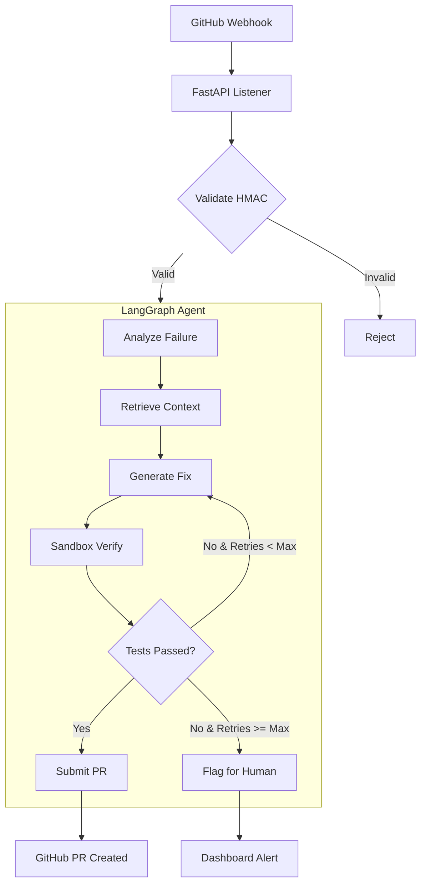

# 🤖 Autonomous DevOps — Self-Healing CI/CD Agent

> **An autonomous agent that listens to GitHub webhooks for test failures, analyzes stack traces, generates fixes, verifies them in a sandboxed Docker environment, and submits verified Pull Requests.**


---

## 📋 Table of Contents

- [Architecture](#-architecture)
- [Prerequisites](#-prerequisites)
- [Quick Start](#-quick-start)
- [Configuration](#-configuration)
- [API Reference](#-api-reference)
- [Project Structure](#-project-structure)
- [Security](#-security)
- [Deployment](#-deployment)
- [Troubleshooting](#-troubleshooting)

---

## 🏗 Architecture

### High-Level Flow



### Key Components

| Component | Technology | Purpose |
|-----------|-----------|---------|
| **Orchestration** | LangGraph | State machine with typed state, conditional edges, and loops |
| **API** | FastAPI | Async webhook listener and REST endpoints |
| **Sandbox** | Docker SDK | Isolated test environment per job |
| **Frontend** | React + Vite + Tailwind | Real-time dashboard and job management |
| **Observability** | Langfuse | Token tracking, cost monitoring, tracing |
| **State** | Redis (optional) | Job persistence and pub/sub |

### The LangGraph State Machine

The agent implements a **Graph Engineering** approach with the following state:

```python
class AgentState(TypedDict):
    repo_url: str
    commit_sha: str
    failure_log: str
    stack_trace: str
    file_path: str
    line_number: int
    error_type: str
    proposed_fix: str
    code_diff: str
    test_results: dict
    pr_url: Optional[str]
    confidence_score: float
    attempts: int
    max_attempts: int
    history: list[str]
    error: Optional[str]
    job_id: str
    agent_thoughts: list[str]
```

### Loop Engineering

- **Retry Loops:** Exponential backoff for transient errors (Docker pulls, API rate limits)
- **Self-Correction Loop:** Failed fixes feed the *new* error back into the LLM with previous attempt context
- **Early Stopping:** Breaks the loop if confidence drops below threshold after 2 attempts, saving tokens
- **Context Pruning:** Only ±10 lines of code sent with each prompt; history trimmed to last 5 entries

---

## ✅ Prerequisites

| Requirement | Version | Install |
|------------|---------|---------|
| Python | 3.10+ | `apt install python3` or [pyenv](https://github.com/pyenv/pyenv) |
| Node.js | 18+ | [nvm](https://github.com/nvm-sh/nvm) or [nodejs.org](https://nodejs.org/) |
| Docker | 24+ | [docker.com](https://docs.docker.com/get-docker/) |
| Docker Compose | 2.x | Included with Docker Desktop |

### API Keys Required

| Service | Purpose | Get Keys |
|---------|---------|----------|
| **OpenAI / OpenRouter** | LLM for code analysis & fix generation | [OpenAI](https://platform.openai.com/api-keys) |
| **GitHub PAT** | Repository access & PR creation | [GitHub Tokens](https://github.com/settings/tokens) |
| **Langfuse** (optional) | Observability & tracing | [Langfuse](https://langfuse.com) |

---

## 🚀 Quick Start

### 1. Clone & Install

```bash
# Clone the repository
git clone https://github.com/Sarancoding/Autonomous-DevOps.git
cd Autonomous-DevOps

# Backend setup
cd backend
python3 -m venv .venv
source .venv/bin/activate
pip install -r requirements.txt

# Frontend setup
cd ../frontend
bun install   # or npm install
```

### 2. Configure Environment

```bash
# Copy and edit the environment template
cp .env.example .env
```

Required variables in `.env`:

```env
# LLM Provider (OpenAI-compatible)
LLM_API_KEY=sk-your-key-here
LLM_API_BASE=https://api.openai.com/v1

# GitHub
GITHUB_TOKEN=ghp_your-token-here
GITHUB_WEBHOOK_SECRET=your-webhook-secret

# Langfuse (optional)
LANGFUSE_PUBLIC_KEY=
LANGFUSE_SECRET_KEY=
```

### 3. Run Locally

**Option A — Docker Compose (recommended):**

```bash
docker-compose up --build
```

This starts:
- Backend on `http://localhost:8000`
- Frontend on `http://localhost:5173`
- Redis on `localhost:6379`

**Option B — Manual:**

```bash
# Terminal 1: Backend
cd backend
uvicorn main:app --reload --host 0.0.0.0 --port 8000

# Terminal 2: Frontend
cd frontend
bun dev
```

### 4. Access the Dashboard

Open [http://localhost:5173](http://localhost:5173)

1. Navigate to **Settings** → Enter your LLM API Key and GitHub Token (BYOK)
2. Go to **Dashboard** → Enter a GitHub repo URL and paste a failure log
3. Click **Run Agent** → Watch the LangGraph execute in real-time

---

## 🔧 Configuration

### Backend Settings

| Variable | Default | Description |
|----------|---------|-------------|
| `HOST` | `0.0.0.0` | Server bind address |
| `PORT` | `8000` | Server port |
| `LLM_API_KEY` | — | OpenAI/OpenRouter API key |
| `LLM_API_BASE` | `https://api.openai.com/v1` | LLM API endpoint |
| `LLM_CHEAP_MODEL` | `gpt-4o-mini` | Model for analysis tasks |
| `LLM_CAPABLE_MODEL` | `gpt-4o` | Model for fix generation |
| `GITHUB_TOKEN` | — | GitHub personal access token |
| `GITHUB_WEBHOOK_SECRET` | — | Webhook HMAC secret |
| `DOCKER_ENABLED` | `true` | Enable sandbox verification |
| `SANDBOX_TIMEOUT` | `120` | Container timeout (seconds) |
| `CORS_ORIGINS` | `http://localhost:5173` | Allowed CORS origins |

### GitHub Webhook Setup

1. Go to your repo → **Settings** → **Webhooks** → **Add webhook**
2. Payload URL: `https://your-domain.com/webhook/github`
3. Content type: `application/json`
4. Secret: Your `GITHUB_WEBHOOK_SECRET`
5. Events: Select **Check runs**, **Push**, and **Workflow runs**

---

## 📖 API Reference

### `GET /api/status`
Health check and system status.

### `POST /api/trigger`
Manually trigger an agent run.

**Body:**
```json
{
  "repo_url": "https://github.com/owner/repo",
  "commit_sha": "",
  "failure_log": "Error: AssertionError in test_login...",
  "max_attempts": 3,
  "model": "gpt-4o"
}
```

### `GET /api/jobs/{job_id}`
Get job status, details, and full log history.

### `GET /api/metrics`
Aggregated metrics across all jobs.

### `POST /api/config`
Update agent settings per session.

### `POST /api/session/keys`
Store user API keys ephemerally (BYOK).

### `WebSocket /ws/jobs/{job_id}`
Real-time log streaming for a specific job.

---

## 📁 Project Structure

```
.
├── backend/
│   ├── main.py                 # FastAPI app entry point
│   ├── config.py               # Environment configuration
│   ├── requirements.txt        # Python dependencies
│   ├── Dockerfile              # Backend container
│   ├── agent/
│   │   ├── state.py            # AgentState TypedDict
│   │   ├── graph.py            # LangGraph state machine
│   │   ├── nodes.py            # Analysis, fix, verify, submit nodes
│   │   └── loops.py            # Retry, backoff, early stopping
│   ├── services/
│   │   ├── docker_sandbox.py   # Docker sandboxed test execution
│   │   ├── github_service.py   # GitHub API integration
│   │   ├── llm_service.py      # LLM with model routing
│   │   └── langfuse_observer.py# Langfuse tracing
│   └── models/
│       └── schemas.py          # Pydantic request/response models
├── frontend/
│   ├── src/
│   │   ├── App.tsx             # Router configuration
│   │   ├── pages/              # Dashboard, JobDetail, Settings, Analytics
│   │   ├── components/         # Layout, LiveLogs, DiffViewer, Timeline, etc.
│   │   ├── hooks/              # useWebSocket
│   │   ├── stores/             # Zustand global state
│   │   └── services/           # API client
│   ├── package.json
│   ├── vite.config.ts
│   ├── tailwind.config.js
│   └── Dockerfile
├── k8s/
│   ├── backend-deployment.yaml
│   ├── frontend-deployment.yaml
│   └── configmap.yaml
├── docker-compose.yml
├── .gitignore
└── README.md
```

---

## 🔒 Security

### Zero-Trust Architecture

- **Bring Your Own Keys (BYOK):** API keys are sent via encrypted headers and stored ephemerally in memory — never persisted to disk
- **No Data Retention:** Source code is processed in memory and deleted after the job completes
- **Sandbox Isolation:** Each job runs in an isolated Docker container with:
  - Network disabled (`network_mode='none'`)
  - CPU limited to 50%
  - Memory capped at 512MB
  - Read-only volumes
- **Audit Logs:** All agent actions are logged with timestamps for transparency

### Best Practices

1. Never commit `.env` files (`.gitignore` is pre-configured)
2. Use a dedicated GitHub PAT with minimal scope (`repo` only)
3. Enable webhook HMAC verification in production
4. Rotate API keys regularly

---

## ☸️ Deployment

### Docker Compose (Single Server)

```bash
docker-compose up --build -d
```

### Kubernetes

```bash
# Create secrets
kubectl create secret generic autodevops-secrets \
  --from-literal=LLM_API_KEY=sk-... \
  --from-literal=GITHUB_TOKEN=ghp_...

# Deploy
kubectl apply -f k8s/

# Check status
kubectl get pods -l app=autodevops
```

### Production Checklist

- [ ] Set `DOCKER_ENABLED=false` if Docker-in-Docker is not available
- [ ] Set `CORS_ORIGINS` to your frontend domain
- [ ] Configure proper secrets management (Vault, AWS Secrets Manager)
- [ ] Set up database-backed job persistence (replace in-memory dict)
- [ ] Configure monitoring and alerting (Prometheus + Grafana)
- [ ] Enable HTTPS with a proper certificate

---

## 🔍 Troubleshooting

### Backend won't start
```
Error: LLM_API_KEY not configured
```
→ Set `LLM_API_KEY` in `.env` or via the Settings page


### Docker sandbox fails
```
docker.errors.DockerException: Error while fetching server API version
```
→ Ensure Docker is running: `docker info`

### WebSocket not connecting
→ Verify CORS origins include your frontend URL
→ Check that the backend is reachable from the frontend

### GraphQL / LangGraph errors
```python
langgraph.graph.GraphValidationError: Node 'generate_fix' not found
```
→ Ensure all agent node functions are properly registered

---

## 📊 Performance

| Metric | Expected | Notes |
|--------|----------|-------|
| Time to analyze | 2-5s | Regex + LLM fallback |
| Fix generation | 5-15s | Depends on model |
| Sandbox verify | 30-120s | First run builds Docker image |
| Token usage/job | 2K-8K | With context pruning |
| Success rate | 70-90% | Varies by complexity |

---

## 🧪 Testing

```bash
# Backend tests
cd backend
pytest -v --cov=.

# Frontend tests (if configured)
cd frontend
bun test
```

---

## 📄 License

MIT License — see [LICENSE](LICENSE) for details.

---

## 🤝 Contributing

1. Fork the repository
2. Create a feature branch
3. Commit your changes
4. Push and open a PR

---

<p align="center">
Built with ❤️ by <a href="https://github.com/Sarancoding">Sarancoding</a><br/>
Powered by LangGraph, FastAPI, and React
</p>
